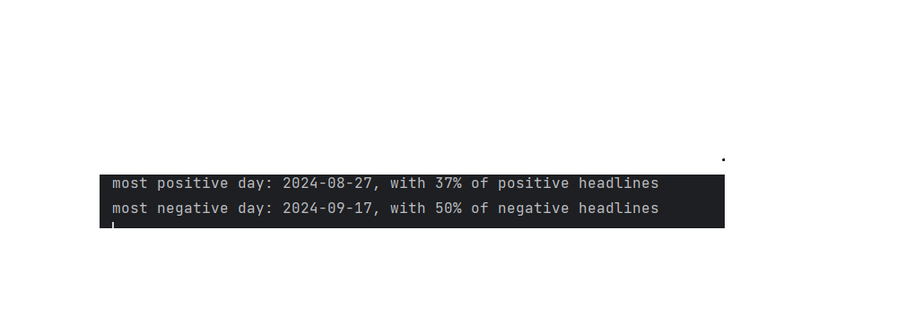
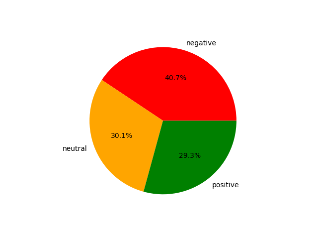

# **Headline Sentiment Analysis for Ynet News**

This project performs sentiment analysis on news headlines from [Ynet News](https://www.ynet.co.il), a popular Hebrew news website. The goal is to classify each headline as **positive**, **negative**, or **neutral** using a fine-tuned version of the **HeBERT** model—specifically adapted for Hebrew language sentiment analysis.


## Table of Contents
- [Project Overview](#project-overview)
- [Installation](#installation)
- [Data Collection](#data-collection)
- [Sentiment Analysis](#sentiment-analysis)
- [Fine-tuning the Model](#fine-tuning-the-model)
- [Visualizations](#visualizations)
- [Usage](#usage)
- [License](#license)

## Project Overview

This project uses web scraping to gather news headlines from Ynet News and then applies a pre-trained BERT model for Hebrew—HeBERT—to classify the sentiment of each headline. The headlines are classified into three categories:

- *Positive*
- *Neutral*
- *Negative*

The model was fine-tuned on a combination of custom data and the HebrewSentiment dataset from Hugging Face to better reflect sentiment trends within the Israeli population, particularly regarding culturally and politically significant headlines.

## Motivation
The original HeBERT model faced challenges with sentiment classification for politically charged or culturally sensitive headlines. For example, headlines such as "Israel won the war against Hamas" were often misclassified due to diverse perspectives.

To address this, I fine-tuned the model on both custom data and the HebrewSentiment dataset from Hugging Face, aiming to make it better suited for sentiment analysis that reflects the sentiment trends within the Israeli population. The fine-tuning process specifically aligned the model to classify sentiments more accurately in culturally and politically significant contexts in Israel, ensuring that the model better represents the perspectives of the Israeli population
## Results

### Extreme Day Results
This image shows the sentiment analysis results for headlines on extreme days with very high or low sentiment scores:



### Headline Sentiment Mapping
This image provides a visualization of the sentiment mapping across various headlines:



### Ynet Common Words
This image shows the 100 most common words found in the headlines, excluding stopwords. It provides insight into the most frequently mentioned topics and terms in the Ynet News headlines.


## Installation

### Prerequisites
Ensure that you have the following installed:
- **Python 3.7 or higher**
- **pip** (Python package installer)
### Step 1: Clone the Repository
First, clone the repository from GitHub:


```bash
git clone https://github.com/llm-projects/news-headlines-sentiment-analysis
cd headline-sentiment-analysis
```
### Step 2: Create a Virtual Environment (Optional but recommended)
Creating a virtual environment helps manage dependencies and prevents conflicts:

```bash
python -m venv venv
source venv/bin/activate  # On Windows use `venv\Scripts\activate`
```
### Step 3: Install Dependencies
Install the required dependencies by using the `requirements.txt` file:

```bash
pip install -r requirements.txt
```
## How to Use

You can use the fine-tuned HeBERT model to perform sentiment analysis with the Hugging Face transformers library. Follow these steps:

```python
from transformers import AutoTokenizer, AutoModel

checkpoint = 'jonkov/heBERT-finetuned-sentiment-classification'  # Fine-tuned HeBERT model

# Load the tokenizer and model
tokenizer = AutoTokenizer.from_pretrained(checkpoint)
model = AutoModel.from_pretrained(checkpoint)

# Use the pipeline
sentiment_analysis = pipeline(
    "sentiment-analysis",
    model=model,
    tokenizer=tokenizer,
    return_all_scores = True
)

# Example usage
headline = "ישראל ניצחה במלחמה את חמאס"
result = sentiment_analysis(headline)

# Output the sentiment result
print(result)