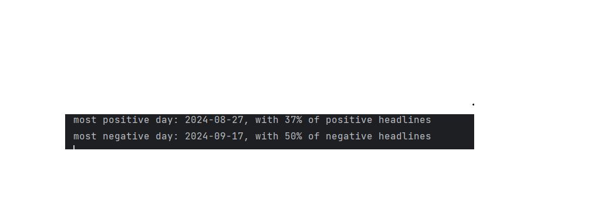

# **Headline Sentiment Analysis for Ynet News**

This project performs sentiment analysis on news headlines from [Ynet News](https://www.ynet.co.il), a popular Hebrew news website. The goal is to classify each headline as **positive**, **negative**, or **neutral** using a fine-tuned version of the **HeBERT** model—specifically adapted for Hebrew language sentiment analysis.

## Table of Contents
- [Project Overview](#project-overview)
- [Motivation](#motivation)
- [Installation](#installation)
- [Sentiment Analysis](#sentiment-analysis)
- [Fine-Tuning the Model](#fine-tuning-the-model)
- [Comparison Between Fine-Tuned and Original Models](#comparison-between-fine-tuned-and-original-models)
- [Visualizations](#visualizations)
- [Usage](#usage)
- [License](#license)

## Project Overview

This project uses web scraping to gather news headlines from Ynet News and then applies a fine-tuned version of the pre-trained BERT model for Hebrew—HeBERT—to classify the sentiment of each headline. The headlines are classified into three categories:

- *Positive*
- *Neutral*
- *Negative*

The model was fine-tuned on a combination of custom data and the HebrewSentiment dataset from Hugging Face to better reflect sentiment trends within the Israeli population, particularly regarding culturally and politically significant headlines.

## Motivation

The original HeBERT model faced challenges in accurately classifying sentiments for politically charged or culturally sensitive headlines. For example, headlines such as "Israel won the war against Hamas" were often misclassified due to the model's limited exposure to such contexts. This limitation highlighted the need for a more contextually aware sentiment analysis tool tailored to Israeli news.

## Fine-Tuning the Model

To address these challenges, the following steps were undertaken:

1. **Initial Fine-Tuning Attempts**: The model was first fine-tuned using the [HebrewSentiment](https://huggingface.co/HebArabNlpProject/HebrewSentiment) dataset and the news subset of the [ShlomiSumit/HebrewDatasets](https://github.com/shlomisumit/HebrewDatasets). However, these datasets lacked sufficient examples related to Israeli conflicts, leading to inaccuracies in sentiment classification for such topics.
    
2. **Synthetic Data Generation**: To bridge this gap, a synthetic dataset comprising 15,000 examples was generated using **Gretel**. This dataset, available in the repository under `data/synthetic_data_15k.csv`, includes diverse examples of conflicts, military actions, and political events pertinent to Israeli news.
    
3. **Final Fine-Tuning**: The model was subsequently fine-tuned on this synthetic dataset, resulting in enhanced accuracy for sentiment classification, especially concerning headlines about conflicts involving Israel and its adversaries.
    

These refinements have improved the model's performance, making it more adept at handling the unique nuances present in Israeli news sentiment analysis.

## Comparison Between Fine-Tuned and Original Models

This section compares the performance of my **fine-tuned HeBERT model** to the original **HeBERT model** when analyzing the sentiment of various sentences. The results demonstrate significant differences between the predictions made by the fine-tuned version and the original (baseline) version.

### Models Compared

1. **Fine-Tuned HeBERT Model**: This model has been specifically fine-tuned on news headlines to better capture sentiment nuances in Israeli news.
    
2. **Original HeBERT Model**: The base model (`avichr/heBERT_sentiment_analysis`) without additional fine-tuning. It serves as the baseline for comparison.
    
## Example Predictions

Here is an example of the predictions made by both the base model (heBERT pretrained) and the fine-tuned model (heBERT-news-sentiment-classifier):

| Text (Hebrew)             | Translation (English)                  | heBERT Pretrained | heBERT-news-sentiment-classifier |
| ------------------------- | -------------------------------------- | ----------------- | -------------------------------- |
| צהל חיסל מחבלים           | The IDF eliminated terrorists          | Negative (99.98%) | Positive (99.99%)                |
| ישראל תקפה אווירית        | Israel launched an airstrike           | Negative (97.66%) | Neutral (99.78%)                 |
| ישראל ניצחה               | Israel won                             | Negative (99.39%) | Positive (99.99%)                |
| חמאס תקף את ישראל         | Hamas attacked Israel                  | Negative (99.96%) | Negative (97.40%)                |
| צהל הצליח לשמור על המדינה | The IDF managed to protect the country | Negative (99.98%) | Positive (99.99%)                |
| איזה יום גרוע היה לי      | What a terrible day I had              | Negative (99.99%) | Negative (99.82%)                |
| אני שמח                   | I'm happy                              | Positive (99.96%) | Positive (99.99%)                |
### Observations

- The **original HeBERT model** tends to classify statements involving military action or national success as **negative**, which is not always accurate in the Israeli context.
    
- The **fine-tuned model** shows improved sentiment classification for news-related content, especially in differentiating positive statements about national achievements and defense.
    
- Examples like "צהל חיסל מחבלים" were classified as **negative** by the original model but correctly identified as **positive** by the fine-tuned model, reflecting its better understanding of the context.

## Results
### Extreme Day Results
This image shows the sentiment analysis results for headlines on extreme days with very high or low sentiment scores:
  

  
### Headline Sentiment Mapping
This image provides a visualization of the sentiment mapping across various headlines:
  

  
### Ynet Common Words
This image shows the 100 most common words found in the headlines, excluding stopwords. It provides insight into the most frequently mentioned topics and terms in the Ynet News headlines.
  

  
## Installation

### Prerequisites
Ensure that you have the following installed:
- **Python 3.7 or higher**
- **pip** (Python package installer)
### Step 1: Clone the Repository
First, clone the repository from GitHub:


```bash
git clone https://github.com/jonathankovler/Machine-Learning-Projects.git
cd Machine-Learning-Projects/news-headlines-sentiment-analysis
```
### Step 2: Create a Virtual Environment (Optional but recommended)
Creating a virtual environment helps manage dependencies and prevents conflicts:

```bash
python -m venv venv
source venv/bin/activate  # On Windows use `venv\Scripts\activate`
```
### Step 3: Install Dependencies
Install the required dependencies by using the `requirements.txt` file:

```bash
pip install -r requirements.txt
```
## How to Use

You can use the fine-tuned HeBERT model to perform sentiment analysis with the Hugging Face transformers library. Follow these steps:

```python
from transformers import AutoTokenizer, AutoModel

# Fine-tuned HeBERT model
checkpoint = 'jonkov/heBERT-news-sentiment-classifier'  

# Load the tokenizer and model
tokenizer = AutoTokenizer.from_pretrained(checkpoint)
model = AutoModel.from_pretrained(checkpoint)

# Use the pipeline
sentiment_analysis = pipeline(
    "sentiment-analysis",
    model=model,
    tokenizer=tokenizer,
    return_all_scores = True
)
```

## License

This project is licensed under the MIT License - see the LICENSE file for details.

